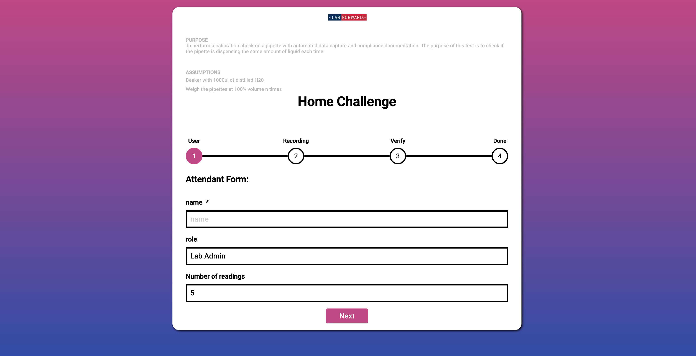
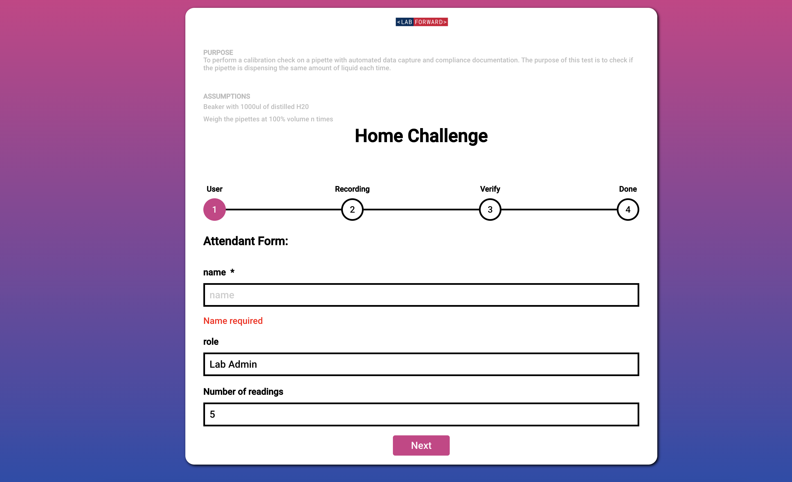
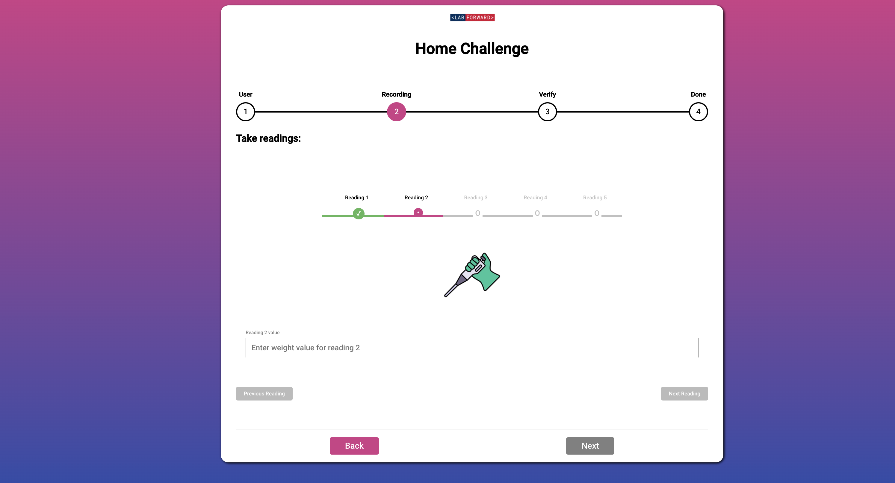
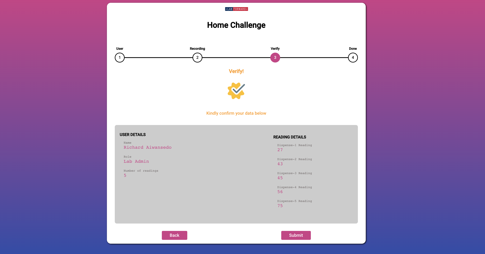
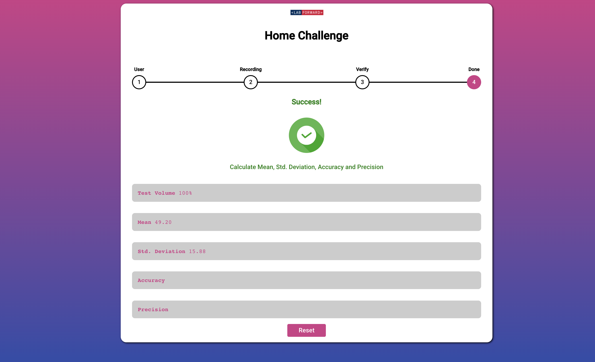
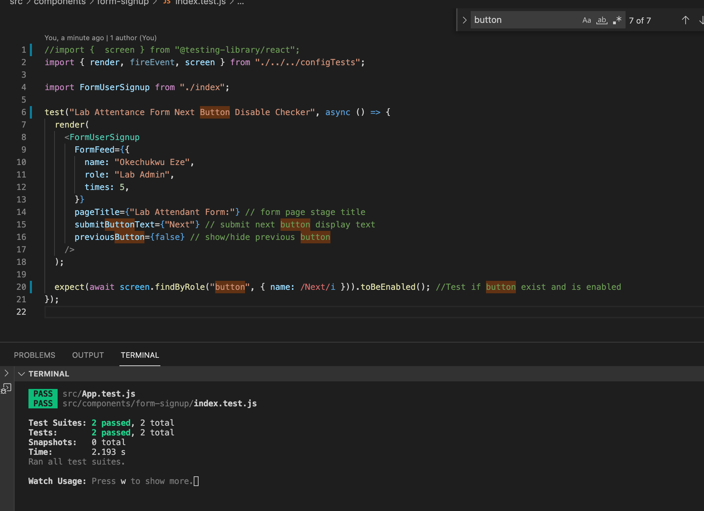
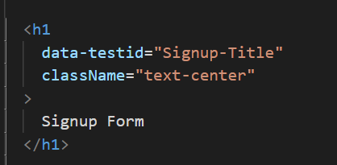
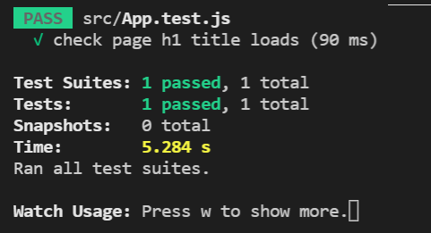

# Routine Pipette Check and Calibration
_[Live Link](https://lab-forward-frontend.web.app/)_
<br />

Created with React, Redux, and SASS. Plus React Lazy Load for Component loading and react-stepzilla for Multi step component.
<br /><br />

## Purpose
To perform a calibration check on a pipette with automated data capture and compliance
documentation. The purpose of this test is to check if the pipette is dispensing the same
amount of liquid each time.
<br />

### Scope & Time Dedicated
This procedure is to be used for demonstrations of automatic calibration and documentation.<br/>
I spend aproximately 6 -7 hours on the assessment. Would have loved to add an End-to-End automated testing using Cypress if I had more time
<br />

### Definitions
Pipette: Pipettes are used to transfer or measure set volumes of liquid.<br/>
Pipette tip: Pipette tips are disposable, attachments for the uptake and dispensing of liquids using a pipette.
<br /><br />


## Procedure
1. Prepare balance<br/>
1.1. Place a beaker with 1000ul of distilled H20 on the balance and tare<br/>
2. Place a new pipette tip on the pipettor<br/>
3. Weigh the pipettes at 100% volume five times<br/>
3.1. Aspirate and dispense 100% of the volume into the beaker<br/>
3.2. Record the weight in the table in step 6.4<br/>
3.3. Tare the balance<br/>
3.4. Repeat steps 6.3.1 to 6.3.3 four more times<br/>
<br />

## Run
````cmd
npm install
npm start
````



## Components

### Attendant Form:
Component for Attendant Page

| Prop Name       | Description           | Example  | Type  |
| ------------- |:-------------:| -----:| -----:|
| pageTitle | form page stage title | {'User Form:'} | `string` |
| submitButtonText | submit next button display text | {'Next'} | `string` |
| previousButton | shows / hides Back button | {false} | `boolean` |

<br />

### Data Recording  Component
Component for recording Dispense 1-5

| Prop Name       | Description           | Example  | Type  |
| ------------- |:-------------:| -----:| -----:|
| pageTitle | form page stage title | {'Privacy Form:'} | `string` |
| submitButtonText | submit next button display text | {'Next'} | `string` |
| previousButton | shows / hides Back button | {true} | `boolean` |

<br />


### Data Verification  Component
Component for verifying inputed data



<br />
<br />
<br />

### Calculation  Component
Component for Calculating Mean, Std. Deviation, Accuracy and Precision


| Prop Name       | Description           | Example  | Type  |
| ------------- |:-------------:| -----:| -----:|
| pageTitle | form page stage title | {'Success!'} | `string` |
| successMessage | Success message to display | {'Thanks for your submission'} | `string` |

<br />


## Testing
__React Testing Library__
<br /><br />
run `npm test` to perform testing
<br />

Basic Test to confirm if Button isEnabled and check page h1 title loads with test id.
<br/>
<br />




